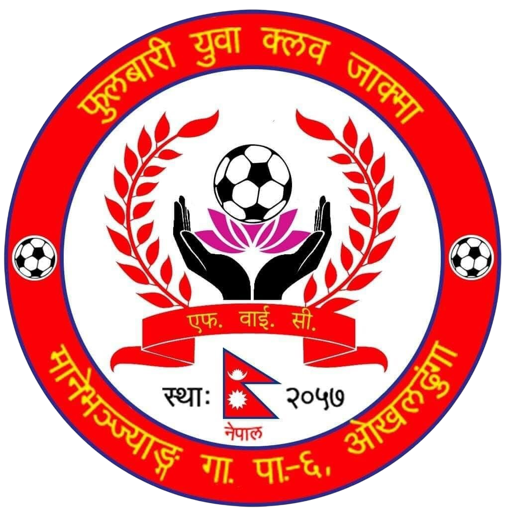

# 🏔️ Fulbari Yuba Club — Official Website

> Official website of **Fulbari Yuba Club**, located at Manyavangyag-6, Jakma, Okhaldhunga, Nepal.

<p align="center">
  
</p>

---

## 📌 About

This is the official web presence of **Fulbari Yuba Club**, a community youth organization based in Manyavangyag-6, Jakma, Okhaldhunga, Nepal. The website serves as a platform for the club to share information about programs, events, notices, and certificates with the community, while also providing an admin panel for club management.

Designed and developed by **Gaurav Sharan Kumar**.

---

## ✨ Features

### 🌐 Public-Facing
- **Home Page** — Overview of the club with highlights and latest updates
- **Programs** — Browse all club programs and activities
- **Notices** — View official announcements and notices
- **Gallery** — Photo gallery showcasing club events and activities
- **Certificates** — View certificates issued by the club
- **Contact Form** — Get in touch with the club directly

### 🔐 Admin Panel
- **Secure Login** — JWT-based authentication for admin access
- **Program Management** — Add, edit, and delete club programs
- **Notice Management** — Publish and manage official notices
- **Gallery Management** — Upload and organize gallery images
- **Certificate Management** — Issue and manage certificates
- **Contact Messages** — View and manage messages submitted through the contact form

---

## 🛠️ Tech Stack

### Frontend
| Technology | Purpose |
|---|---|
| React.js | UI framework |
| Vite | Build tool |
| Tailwind CSS | Styling |

### Backend
| Technology | Purpose |
|---|---|
| Node.js + Express | REST API server |
| MongoDB + Mongoose | Database |
| JWT | Authentication |
| Helmet | Security headers |
| Express Rate Limiter | API rate limiting |

### Deployment
| Service | Usage |
|---|---|
| Vercel | Frontend & Backend hosting |
| MongoDB Atlas | Cloud database |

---

## 🚀 Getting Started

### Prerequisites
- Node.js >= 18
- MongoDB Atlas account (or local MongoDB)
- npm or yarn

### 1. Clone the Repository
```bash
git clone https://github.com/gauravsharansah/fulbari-yuba-club.git
cd fulbari-yuba-club
```

### 2. Setup Backend
```bash
cd backend
npm install
```

Create a `.env` file in the `backend` directory:
```env
MONGODB_URI=your_mongodb_connection_string
JWT_SECRET=your_jwt_secret_key
ALLOWED_ORIGINS=http://localhost:5173
PORT=5000
```

Start the backend:
```bash
npm run dev
```

### 3. Setup Frontend
```bash
cd frontend
npm install
npm run dev
```

The app will be available at `http://localhost:5173`.

---

## 🌍 Environment Variables

### Backend (`.env`)
| Variable | Description | Required |
|---|---|---|
| `MONGODB_URI` | MongoDB connection string | ✅ |
| `JWT_SECRET` | Secret key for JWT tokens | ✅ |
| `ALLOWED_ORIGINS` | Comma-separated list of allowed frontend URLs | ✅ |
| `PORT` | Port for the server (default: 5000) | ❌ |

### Vercel Deployment
Set the following in your Vercel backend project under **Settings → Environment Variables**:
```
MONGODB_URI=...
JWT_SECRET=...
ALLOWED_ORIGINS=https://fulbariyubaclub.vercel.app
```

---

## 📁 Project Structure

```
fulbari-yuba-club/
├── backend/
│   ├── config/
│   │   └── seed.js           # Admin seeder
│   ├── models/
│   │   └── User.js           # User schema
│   ├── routes/
│   │   ├── auth.js           # Authentication routes
│   │   ├── certificates.js   # Certificate routes
│   │   ├── contact.js        # Contact form routes
│   │   ├── gallery.js        # Gallery routes
│   │   ├── members.js        # Members routes
│   │   ├── notices.js        # Notices routes
│   │   └── programs.js       # Programs routes
│   ├── server.js             # Express app entry point
│   ├── vercel.json           # Vercel deployment config
│   └── package.json
├── frontend/
│   ├── src/
│   │   ├── components/       # Reusable UI components
│   │   ├── pages/            # Page components
│   │   └── main.jsx          # App entry point
│   └── package.json
└── README.md
```

## 🤝 Contributing

This is an official club website. For suggestions or issues, please open a GitHub Issue or contact the developer directly.

---

## 👨‍💻 Developer

**Gaurav Sharan Kumar**
- GitHub: [@gauravsharansah](https://github.com/gauravsharansah)

---

## 📍 Club Location

**Fulbari Yuba Club**
Manyavangyag-6, Jakma
Okhaldhunga, Koshi Province
Nepal 🇳🇵

---

## 📄 License

This project is licensed under the [MIT License](LICENSE).

---

*Built for Fulbari Yuba Club — Est. 2057 BS 🇳🇵*